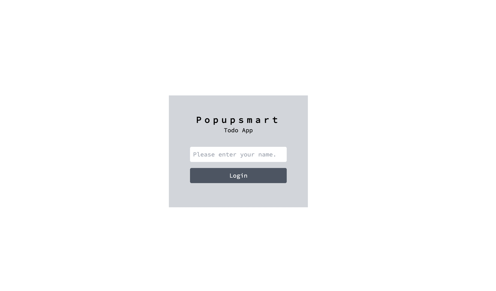

# Popupsmart-Practicum-Todo-Case

Live: https://cembicakci.github.io/popupsmart-practicum-case




## Tools
* React
* Context API
* Tailwind Css
* React-router
* React-icons
* Axios
* Mockapi.io

## Features
* You can add, edit and delete your items
* Login
* localStorage 
* Dark mode
* Responsive

## Usage
```
npm install
npm start
```